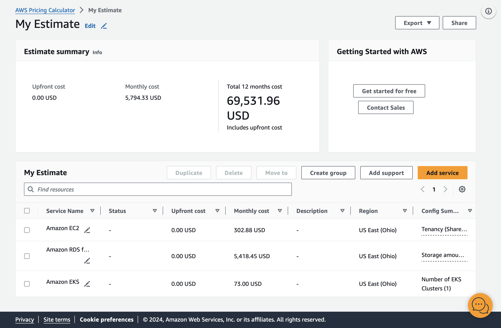
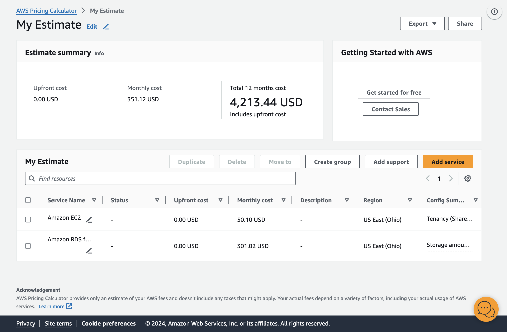
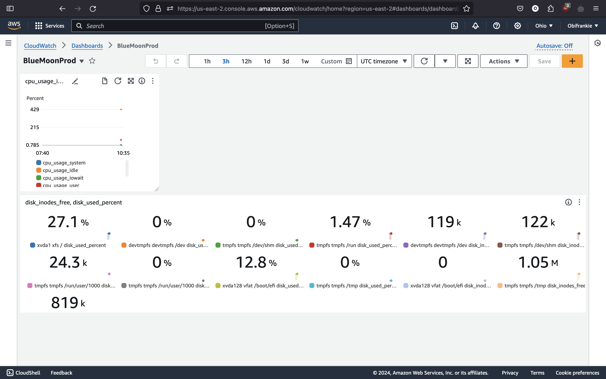
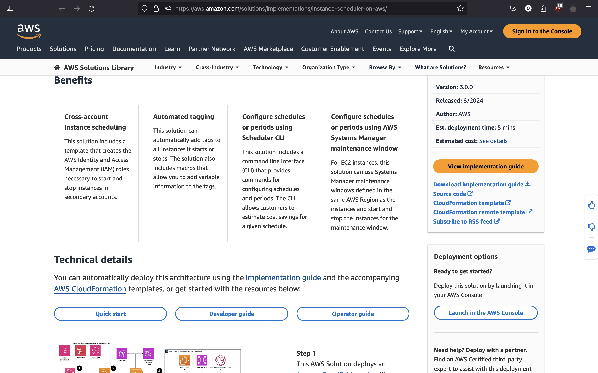
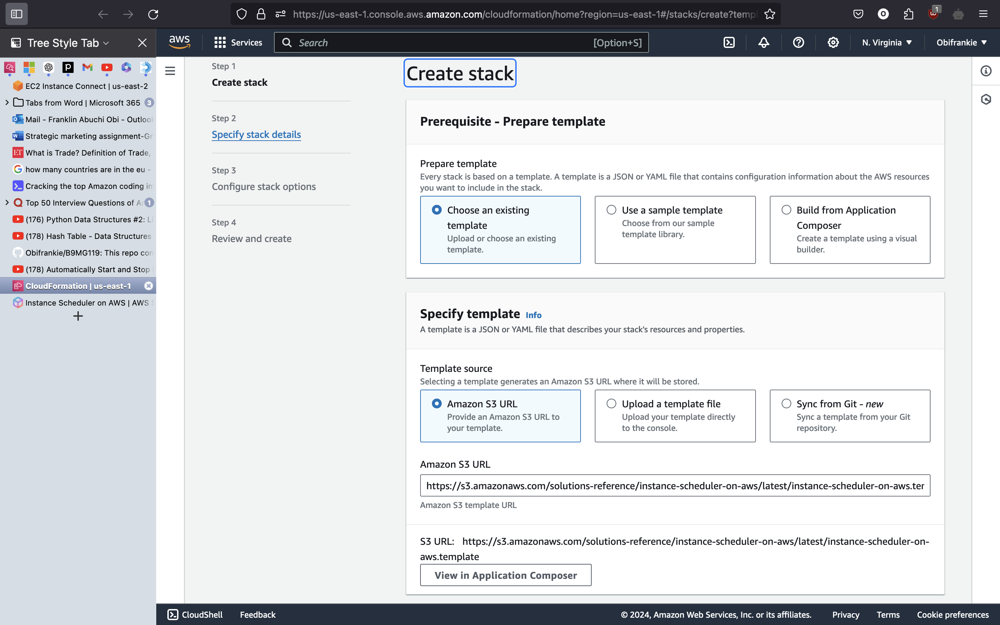
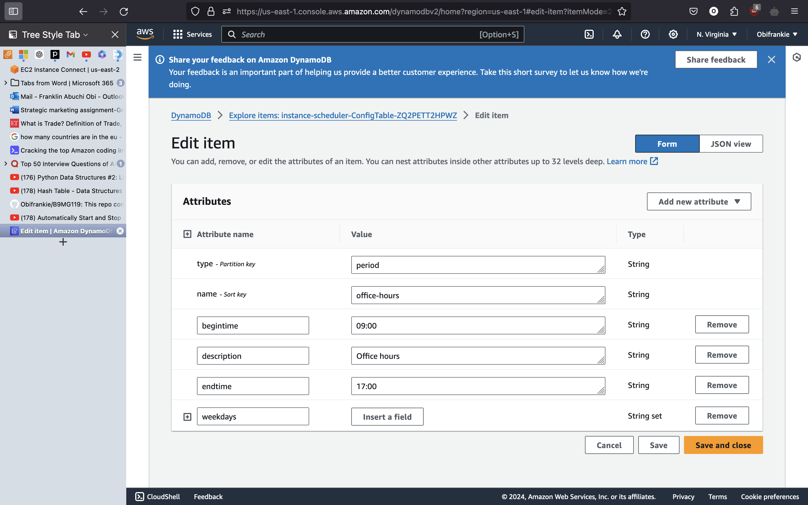
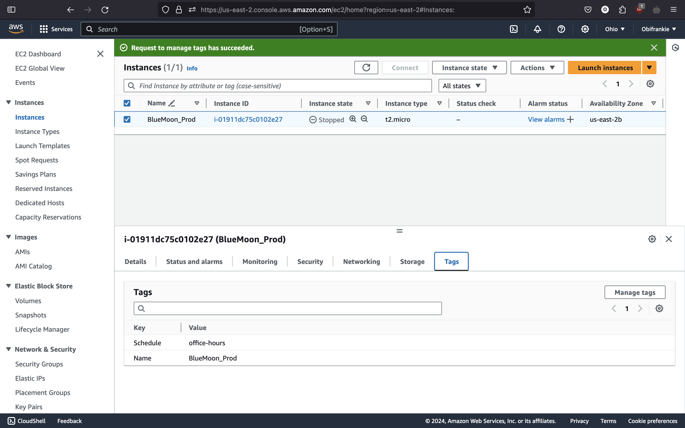

# Cloud Technology for Business (B9MG119)   

  

This repo contains the Cloud Strategy and Sample Deployment of an organization called Blue Moon  

  

   

  

## Background of Blue Moon  

  

Blue Moon is a startup that has been operational for the last five years in the Ghana area of West-Africa. They have experienced average growth for the last few years, but their customer base is easily quantifiable. Blue Moon is a fintech, they collaborate with Banks to provide a credit model to give out loans to users. This model rates users and gives them a score, with this score the bank can determine if to give a loan to said user or reject the loan. It also helps them decide the range of amount loan a user is eligible for. Asides Collaborating with banks Blue Moon also operates its own loan management system which it uses to give loans directly to its customer base. Blue Moon has a current monthly spend of over $5,036 Blue Moon have noticed that they are overspending for their cloud infrastructure and would like to reduce cost while also optimizing their cloud usage  

  

   

  

## Current IT setup  

  

Blue Moon used to have an engineering team of about 25 engineers but recently they have downsized, and they currently have a team of 12 engineers. The team includes   

  

- 2 Backends  

  

- 2 Frontends  

  

- 1 DevOps  

  

- 3 Mobile Devs(iOS/android)  

  

- 2 Testers  

  

- 1 Customer Success  

  

- 2 Product Managers  

  

- 1 Product Designer  

  

- 1 CTO  

  

   

  

   

  

The team tries to follow the Agile Methodology; they have daily standup, demo days, sprints, a sprint board, backlogs etc.  

  

   

  

Blue Moon uses AWS as its default cloud provider. Below is a list of its current architecture  

  

- 9 EC2 instances  

  

- Auto-Scaling for both EC2 and RDS  

  

- 15 RDS instances  

  

- over a 100 S3 buckets  

  

- 49 IAM users  

  

- 9 Access Keys  

  

- 1 Kubernetes Cluster  

  

- 2 VPC  

  

- 27 security groups  

  

- Domains Hosted in GoDaddy  

  

- Grafana & Prometheus hosted on an EC2 instance  

  
EC2 INSTANCES
Ec2 is a virtual server provided by amazon web service that allows businesses create and operate apps faster. It allows you to scale up or down the server numbers to meet-up with operations demand.
For example, Brown Thomas in preparations for black Friday will need to scale up to meet up with high influx of customers. To ensure that the high number of customers does not affect load time and response rate, servers would be increased to meet up with the estimated expected influx.

AWS AUTOSCALING FOR EC2
AWS autoscaling observes application and automatically adjusts its capacity (increase or decrease) to ensure consistent and efficient operations at the lowest price possible. It can be set up to meet up with multiple resources across numerous services in minutes. Scaling is recommended based on the business need to save cost or improve performance or a combination of both 

AWS RDS AUTOSCALING
To prevent downtime and save cost, RDS provides an automated storage scalability for relational databases like mysql, microsoft sql server, Oracle amongst many others. This is done by monitoring the database storage usage and adjusting to its consumption. When consumption is high, RDS increases the number of storage capacity available and vice versa. 

S3 BUCKETS
It is a simple storage service that allows user store and retrieve data at any time on the web. Users will create buckets in a region of their choice, select storage class, determine access controls. The buckets are encrypted to provide security and allow for adequate scalability of storage. 

GRAFANA AND PROMETHEUS USING EC2 INSTANCE
Grafana is a data visualization and monitoring tool that connects with open-source platforms to create a time series analytics of data. It allows users create alerts, annotate and transform data while creating customizable dashboards that provide insights into errors, application and user behaviours etc.

   

  

Of the 9 EC2 instances only 3 are of importance for everyday use and they are:  

  

- 1 EC2 instance for production Api (Prod Env)  

  

- 1 EC2 instance for testing Api (Test Env)  

  

- 1 EC2 instance hosting the company website  

  

The other EC2 instances were created for some other purposes that were abandoned at some point but these EC2 instances were not decommissioned, and they have been paying bills on this purposeless instance. They have an instance solely dedicated for renewing their SSL certificates, this is not an appropriate use of an EC2 instance  

  

   

  

The Auto-Scaling is currently not serving any purpose because they are only serving only a small customer base in Ghana. This should be removed   

  

   

  

Of the 15 RDS instances, there are 3 clusters. The clusters serve the following purposes:  

  

- The Production RDS cluster is the cluster for production workloads  

  

- The Test RDS cluster is the cluster for Test workloads  

  

- The Web cluster is the cluster for the Website  

  

Some RDS instances are only serving a single purpose hosting a single database and by so doing underutilizing the RDS instances. This database should be merged into a single database and decommission the redundant databases  

  

   

  

The 2 VPC are serving the Production and Test Environments, respectively.  

  

   

  

The IAM Service is the companies default Identity service for their cloud environment  

  

   

  

   

  

   

  

## Recommendations   

  

After careful review and monitoring of the organizations we have been able to deduce that the organization is overspending on its cloud usage. The current Billing of the organization is $5,036 which is a lot considering the size of the organization and the quantity of users they serve. Our current recommendations are as follows. The recommendations are going to be grouped under 4 major categories   

  

   

  

### Cost  

  

- Delete EC2 instances that do not serve any purpose: we are doing this because after looking at the environment we noticed that some instances did not serve any particular purpose.  

  

   

  

- Merge EC2 instances: Some instances had nothing running on them, some instances were used for the sole purpose of just renewing SSL certificates. This is not a proper use of an instance the SSL certificates can be moved to the instances hosting the Test and Production instances. Test certificates should be moved to the Test instance and the Production certificates should be moved to the Production instance by so doing we are cutting down the costs we incur paying for compute that do not serve any purpose.  

  

   

  

- Migrate databases: We noticed that some RDS instances were running single databases and by so doing underutilizing the database instances. We are going to migrate these single databases to the Test database and the Prod database. All test-related databases would be migrated into the Test cluster and all Prod related databases into the Prod cluster. This way we would be cutting down costs we incur for paying for under-utilizing databases  

  

   

  

- Delete RDS instances that do not serve any purpose: We are doing this because we noticed that some RDS instances are not serving any purpose by so doing we are not paying for RDS instances we are not using.  

  

   

  

- Delete the Kubernetes Cluster: The Kubernetes cluster is currently not being used. It was being provisioned for a use case but was abandoned half-way, but the instance was not decommissioned, and Blue Moon has been paying for this cluster while not using it.  

  

   

  

- Terminate the EC2 instance hosting Grafana and Prometheus: We can use CloudWatch to currently fulfill Blue Moon's monitoring use case. The Grafana and Prometheus tools are currently being hosted on an EC2 instance although this is recommended and would good addition to Blue Moon monitoring systems, we would have to decommission them for now because it is currently on being used to monitor one EC2 instance and we are incurring cost running this EC2 instance used to host the Grafana and Prometheus tools  

  

   

  

- Review the S3 Buckets delete the empty buckets or buckets that do not serve any purpose: S3 is AWS object storage option, and this is hosted on the cloud. using AWS S3 is very advisable but after going through the items in Blue Moon S3 we noticed so many redundant files are stored there and many objects that do not serve any particular purpose to Blue Moon we are going the trim down the fat in Blue Moon S3 and by so doing we are going to reduce cost  

  

   

  

- Review the S3 Buckets and use storage tiers: AWS has storage tiers we can take advantage of. This storage allows us to trade the availability of our S3 buckets for costs. So, we pay more for only items we need to always be easily available, and we would pay less for items that we do not need to be always readily available. By doing this we are helping Blue Moon achieve their goal of cutting down cloud costs    

  

   

  
- Implement EC2 Instance saving plans: This is option is a great addition to Blue Moons infrastructure because we know that we are going to running a particular number of instances for over a period of at least 3 years. So, by dedicating to an EC2 savings plan with AWS we are able to save at least an extra 66% on our monthly expenditure on running these EC2 instances. 

- Implement an Instance Scheduler: An instance scheduler is AWS optio to help us automate the starting and stopping of our AWS compute resources like EC2 and RDS. For example we don't need out Test environment running 24/7 during the night and weekends we can turn automatically turn of the Test Instances and databases so we are not paying for it during hours when no one is using it.

- Resize EC2 Instances: We noticed that some of the instances are also being underutilised because the instnace size Blue Moon is using is to big for example currently Blue Moon is using a t2.large instance and this does not suit their use case at because this instances are greatly underutilised we are going to resize them to suit Blue Moon work performance and to also save cost. So we are going to resize the EC2 instances to use t2.medium instance family size and the database

- Resize RDS Instances: For the same reasons we have started above we are going the resize the databases as well because they are being underutilised and we are paying for capacity that we are not using currently the database is using db.m4.2xlarge we are going to resize the databse to use db.t3.micro because this Blue Moons use case better and we are not paying for capacity we are not using.

### Monitoring   

  

- Install CloudWatch agent to gather metrics for the instances: We are doing this so we can have robust monitoring for the instances. We are doing this so we can gather logs and metrics and have better insights on our instances. We are going to use the logs and metrics gathered by the CloudWatch agent and create dashboards on AWS CloudWatch. We can create a host of dashboards using these metrics ranging from health, CPU utilization, Storage, heartbeat and most importantly we can gather custom metrics and logs on Blue Moon services that are hosted on this EC2 instances. With this metrics we are gathering, we can configure alarms to alert us if any of Blue Moon service is doing poorly and if any problems might occur with our instances so we can mitigate it before it causes a Prod outage.  

  

   

  

- Configure AWS budget and thresh holds to monitor cost and send an alarm when cost has passed a certain threshold. This would allow you to be on top of your cloud spendings. We can be notified for cases when we are overspending again this would help us achieve Blue Moon goal of reducing their cloud costs  

  

   

  

- Configure AWS cost anomalies. AWS cost anomaly uses advanced machine to monitor your cloud usage and spending so AWS can alert you if it notifies any anomality in our cloud usage for example if your daily usage is $100 a day and suddenly it spikes to $900 a day this indicates to an anomaly so AWS would flag this as an anomaly and an alarm can be raised. Then we can mitigate or correct based on this alarm.  

  

   

  

- Configure Metric Dashboards on CloudWatch: We are going to configure Metrics Dashboard on CloudWatch we would use to have a bird's eye view into the performance of all our systems. We can investigate how our instances perform, how Blue Moon propriety services work we can see metrics like how often the crash, how often they restart, peak performance hours, quantity of requests etc. This would help us mitigate future issues, prevent system downtime, and build a more robust infrastructure.  

  

   

  

### Performance   

  

- Move DNS hosted on GoDaddy to Route 53: We are doing this to cutdown the amount of 3rd party services that our system relies on. This would reduce the possibility of downtime due to 3rd party failures. We also doing this because the team has AWS expertise so this would help make management operations easier and we want to take advantage of the support AWS provides, this would take away some of the domain management overhead from the team and allow it to be handled by AWS.  

  

   

  

- Configure cloud Metrics Dashboard on CloudWatch this gives you greater view to how your performance is performing: as we have pointed out previously a dashboard would allow us into grater insights and allow us to optimize our systems performances to provide a better performing system while still cutting costs   

  

   

  

- Review the S3 Buckets delete the empty buckets or buckets that do not serve any purpose: as started earlier we are doing this so we can cut cost, but this would also allow Blue Moon have a cleaner environment and be sure they are only storing things that are essential to Blue Moon and not just random items.   

  

   

  

- Review the security groups and delete redundant security groups, this would allow for better management and connectivity of internal resources. By so doing we can make sure that we are only maintaining the security groups that Blue Moon uses to prevent accidentally deleting or modifying Production based security groups  

  

   

  

- Create AWS Backup vaults for the infrastructure to easily recover it: We need to set up some Disaster recovery plan for Blue Moon. We are doing this to make sure Blue Moon is properly protected in case of disaster or outages so they can quickly recover their infrastructure. We are doing this to reduce unplanned downtime.  

  

   

  

- Remove the auto-scaling: We are doing this because Blue Moon does not require auto-scaling because they are currently serving a small customer base and we are not expecting an unexpected increase in requests soon. To also handle cases when we might need to scale up, we are going to set up threshold alerts so if in the future Blue Moon needs to scale up or scale out their infrastructure, we can properly handle it or we can then setup of a proper auto-scaling group. Although we do not incur cost for the security group, we want Blue Moon to have a clean and manageable cloud environment and remove as much overengineering as we can remove.  

  

   

  

   

  

   

  

### Security  

  

- Look through your IAM users and review the accounts that are needed and delete the ones that are not needed. This is to reduce the amount of people that have access to your AWS environment. We are doing this because IAM accounts that are not properly monitored and accounted for can be a back door for malicious users. So, performing this cleanup to make sure we are properly accounting for every AWS IAM account in our environment. 

  

- Review the IAM policy and access level attached to each IAM user: We also need to look at the policy and the access level attached to each AWS IAM account to make sure we are following the least privilege principle. 

  

- Review the EC2 keys and delete the redundant keys: The EC2 keys are used by EC2 instances to authenticate against our AWS IAM account and if this policy falls into the wrong hands, they can potentially have direct access to all our AWS estate. So, we are deleting keys that do not serve any purpose and accounting for only keys that Blue Moon needs  

  

- Review the Access Levels on each key: The Access Level attached to each EC2 key would be reviewed too because we only want to give this EC2 access to only resources they require. We are doing this to fine grain the access to our AWS environment, we are also doing this for cases when the keys fall into the wrong hands so they have extremely limited access to our environment and would not be performing any actions that can affect our environment. 

  

- Use Secret Manager to manage secret values: We are performing this activity to secure our secret credentials that Blue Moon services require. This way we would not be exposing our sensitive credentials to the public internet  

  

- Enable 2FA for all accounts: We would also enable 2FA for every AWS IAM account in Blue Moons AWS environment by so doing we are increasing our security score on the cloud. So, even if any of our AWS IAM accounts happens to fall into the wrong hands, they would still not be able to sign-in into Blue Moon AWS environment because of the extra layer the 2FA provides Blue Moons AWS environment. 

  

   

  

The tools that would be used to achieve the current goals are:  

  

- CloudWatch: this is an AWS SaaS offering to help you monitor and gain metrics on your resources   

  

- IAM: We will use to grant granular control to principals   

  

- AWS Billing and Cost management: This is a SaaS solution it is AWS cost center to aggregate all your cloud spending  

  

- EC2: This is AWS compute service it is an IaaS offering  

  

- RDS: This is AWS relational database offering it is a PaaS service.  

  

- Instance Scheduler   

  

- AWS Backup Vault   

  

- 2FA (Multi-Factor Authentication) 

 

 

## Detail of Costs
Since Blue Moon is already using a cloud provider our cost calcution is goig to come from the standpoint of cost saving on the cloud. We are going to calculate how much we are going to save Blue Moon once we implement our recommendations. We are going to compare Blue Moon current monthly spend and how much Blue Moon monthly spend would be after implementing our recommedations.

Below is a breakdown of Blue Moon current spend using the AWS Pricing Calculator referenced in fig 1.0 below

fig 1.0

If Blue Moon implements are recommendations we can help Blue Moon to save an extra 93.88% on their cloud expenditure. Below is a breakdown of Blue Moon predicted if Blue Moon implements our recommendation using the AWS Pricing Calculator referenced in fig 1.1 below

fig 1.1

P.S. Note: That the price for AWS Backup Vault was not included in the pricing because there was no option to add it to the pricing on the pricing calculator and the price for CloudWatch is not detailed added to the pricing because we are not currently certain about how much metrics we would be gathering because this are custom metrics.  

The 93.88% savings was calculated using the following formula

Find the difference between the original price and the reduced price:

Difference = Original Price − Reduced Price

Difference = 69,531.96 − 4,213.44= 65,318.52 USD

Calculate the percentage saved:

Percentage Saved = (Difference / Original Price) × 100

Percentage Saved = (65,318.52 / 69,531.96) ×100

Percentage Saved = (0.938) × 100 = 93.88%

## Sample Cloud Infrastructure Deployment

We are now going to configure a cloudwatch agent for our EC2 instance. Below are the steps we are going to take to complete this task

### Configure the CloudWatch agent

- Create the IAM role necessary for each server to run the CloudWatch agent 

- Use the AWS Systems Manager to install the cloudwatch agent on the instance

- Install CollectD on the instance.

- Run the CloudWatch Agent on the EC2 instance using the following command sudo /opt/aws/amazon-cloudwatch-agent/bin/amazon-cloudwatch-agent-config-wizard

- Leave the default options or select your own default options 

- Finish the configuration by running the following command sudo /opt/aws/amazon-cloudwatch-agent/bin/amazon-cloudwatch-agent-ctl -a fetch-config -m ec2 -s -c file:configuration-file-path

- Start the cloudwatch agent sudo systemctl start amazon-cloudwatch-agent 

- Goto Cloudwatch dashboard and view the log groups

### Configure the Cloudwatch Dashboards

- On the AWS Console search for cloudwatch

- On the cloudwatch service click on Dashboard

- Click Add to Add a new metrics, logs or Alarm

- Then select the type of widget you want to add 

- Then Add the source where you want to collect metrics from (this would be from the cloudwatch agent we have setup )

- Then select the type of metrics you want to collect (the namespace)

Below in fig 1.2 shows the custom metrics we have setup for our cloudwatch dashboard 

fig 1.2

### Configure the Instance Scheduler 

- We are going to provision the instance scheduler using the template from AWS

- Visit this link [Amazon Instance Scheduler ](https://aws.amazon.com/solutions/implementations/instance-scheduler-on-aws/).

- Click Launch in AWS Console (This would auto complete an aws template to use) fig 1.3 Shows the AWS Documentation page 

- Give the stack a name and choose your desired configuration (We used the default because it suits our  use case)

fig 1.4

- Once the stack is created. on the gobal search goto DynamoDB

- On the DynamoDb select the table that has a suffix of config 

- On the config table edit any of the enteries for time and date or create your own entry

- We edited the office-hours entery because it suits our use case 

fig 1.5

- Then on the Global search go back to EC2 and select the EC2 instances you want to automate their start and stop 

- Edit the tags of this EC2 and add a tag of Schedule : office-hours. Here Schedule serves as the key and office-hours serves as the schedule. (We are using this tag because this tag would allow the instance scheduler know what time periods to use to automate the staart and stop of the instance )

fig 1.6

Reference 

https://aws.amazon.com/savingsplans/compute-pricing/

https://docs.aws.amazon.com/AmazonCloudWatch/latest/monitoring/create-iam-roles-for-cloudwatch-agent.html#create-iam-roles-for-cloudwatch-agent-roles

https://www.how2shout.com/linux/how-to-install-collectd-on-amazon-linux-2023/

Links 
RDS & EC2
https://aws.amazon.com/rds/instance-types/
https://spot.io/resources/aws-autoscaling/scaling-ec2-ecs-rds-and-more/
https://aws.amazon.com/autoscaling/
https://granulate.io/blog/ec2-auto-scaling-examples-challenges/
https://aws.amazon.com/rds/instance-types/
https://aws.amazon.com/ec2/instance-types/
https://docs.aws.amazon.com/AWSEC2/latest/UserGuide/concepts.html
https://sumologic.com/glossary/aws-ec2/#:~:text=Amazon%20Web%20Service%20EC2%20(Amazon,in%20Amazon%20Web%20Services%20terminology.

S3 BUCKETS
https://www.onixnet.com/blog/what-is-amazon-s3/
https://www.seagate.com/gb/en/blog/how-amazon-s3-buckets-work/
https://docs.aws.amazon.com/AmazonS3/latest/userguide/Welcome.html

GRAFANA AND PROMETHIS USING E2C INSTANCE
https://scaleyourapp.com/what-is-grafana-why-use-it-everything-you-should-know-about-it/
https://www.redhat.com/en/topics/data-services/what-is-grafana

